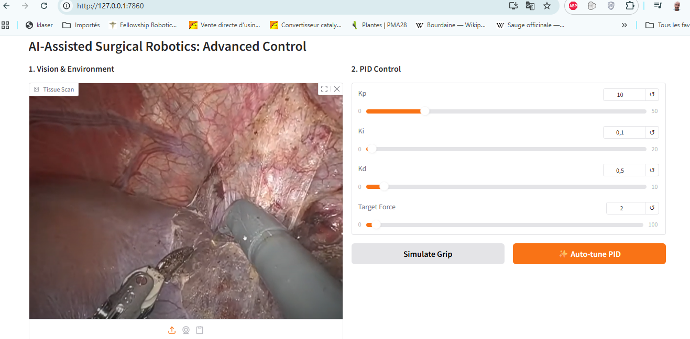
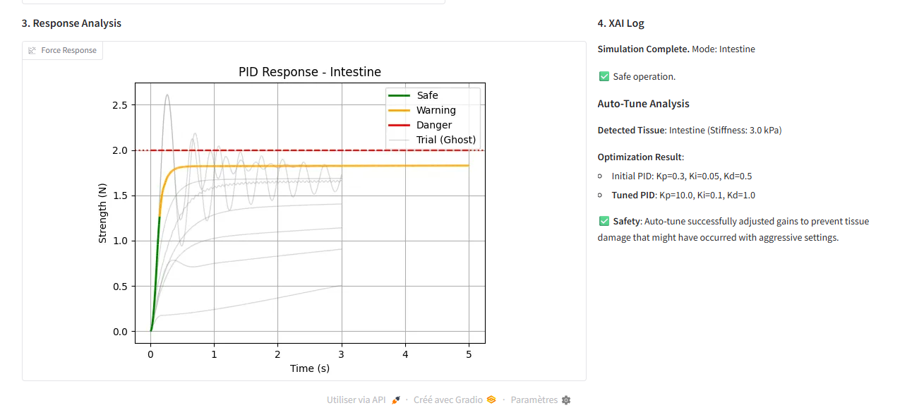
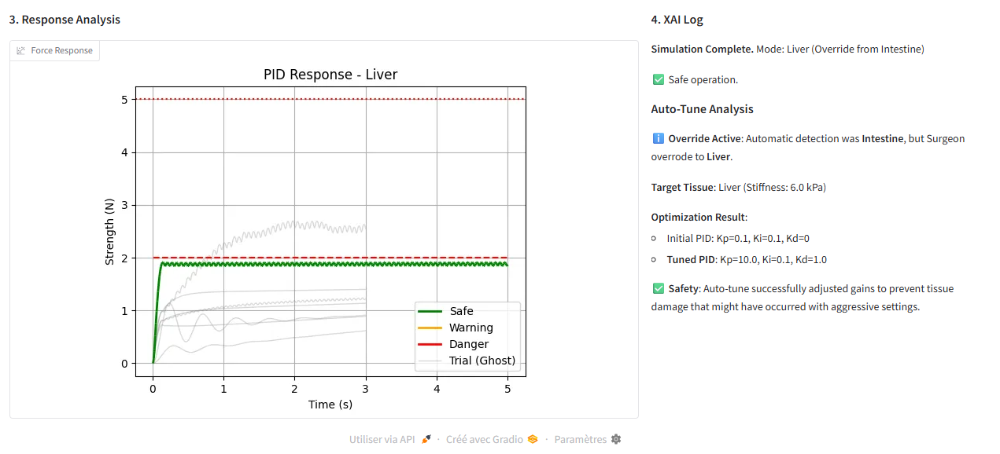
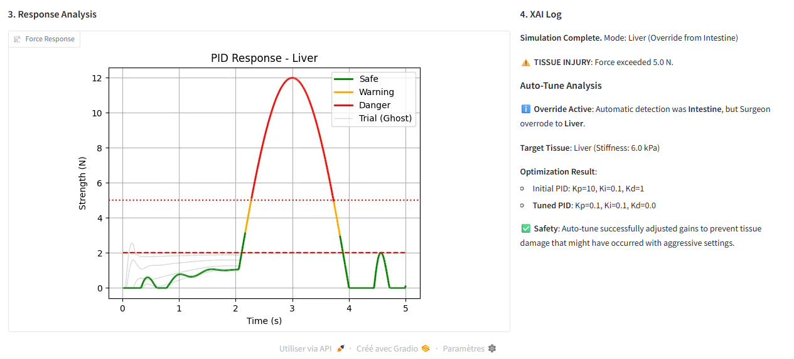

# 🏥 AI-Assisted Surgical Robotics: Antigravity Control (PoC)

> **Concept:** Applying *agentic AI* principles (inspired by Google Antigravity) to surgical robotics to create safer, tissue-aware autonomous grasping.

---

## 📸 Preview

  
  
<em>Figure 1 – Agentic interface: tissue suggestion, PID tuning and safety visualization in real time.</em>

---

## 🩺 The Problem

Current surgical robots (Da Vinci, Hugo RAS, Versius, etc.) mostly operate as **master–slave** systems:

- No real understanding of **which** tissue is being grasped.
- Little or no **true haptic feedback**; surgeons often rely on “visual haptics” (watching tissue whitening and deformation).
- A very precise but essentially fixed controller is used whether the robot is holding:
  - a needle,
  - a vascular pedicle,
  - a friable liver lobe,
  - or a bowel loop.

If the same force is applied to a needle and to an intestinal wall, tissue damage is almost guaranteed.

---

## 🤖 The Idea: “Antigravity” for Surgery

This project is a **Proof of Concept (PoC)** showing how an AI agent can act as a **co-pilot** between the surgeon and the robotic end-effector.

Inspired by Google’s Antigravity demos (where an agent learns to balance a cartpole by understanding physics), this prototype agent:

1. **Sees** the tissue  
   via an image input (laparoscopic frame).
2. **Understands** the physics  
   by mapping to a tissue profile (stiffness, breaking point).
3. **Adapts** the control  
   by automatically tuning a PID force loop to minimise overshoot and avoid simulated tissue injury.

The result is an interactive “digital twin” of a surgical gripper that is tissue-aware.

---

## ✨ Key Features

### 1. Multimodal Tissue Perception

- Image input using Gradio (simulated laparoscopic frames or still images).
- Simple, prototype-level tissue classification:
  - Liver
  - Intestine
  - Bone / Gallbladder (configurable)
- Each tissue is associated with:
  - **Stiffness** (Young-like modulus in kPa),
  - **Breaking point** (maximum safe force in N),
  - **Friction** and default PID gains.

> The classifier is intentionally simple (color / ROI based) and mainly serves as a hook for future real vision models (YOLO, Gemini, custom CNN, etc.).

---

### 2. Physics-Aware PID Control

- Simulates a **1D grip force** controlled by a PID (Kp, Ki, Kd) toward a target force.
- Uses tissue stiffness to model how force grows with deformation:
  - Soft intestine vs stiffer liver vs rigid bone all react differently.
- Integrates per-tissue breaking points to define **safe vs dangerous** force zones.

---

### 3. Agentic Auto-Tuning (The “Brain”)

- One-click **Auto-Tune PID** button.
- The agent:
  - runs multiple fast simulations in the background,
  - evaluates a cost function such as:  
    `Cost = Overshoot + SettlingTime + 1000 * DamageFlag`,
  - rejects any PID candidate that:
    - overshoots too much,
    - or exceeds the tissue breaking point.
- Visual feedback:
  - **Ghost curves** (light grey): failed attempts.
  - **Final tuned curve**: highlighted in green / yellow.

---

### 4. Explainable AI (XAI) Decision Log

No black box. The UI includes a **Decision Log** that explains:

- Detected tissue vs surgeon override.
- Initial PID vs tuned PID.
- Overshoot and maximum force relative to the tissue limit.
- A short explanation, for example:  
  *“Tissue detected as Liver (friable). Reduced Kp by 40% and increased Kd to limit overshoot and avoid crossing the 5 N breaking point.”*

This makes the agent’s behaviour transparent and auditable.

---

### 5. Surgeon-in-the-Loop Override

- The system suggests a tissue type from the image.
- A dropdown allows the surgeon to **override** the tissue:
  - “Auto (from image)”
  - “Liver”
  - “Intestine”
  - “Bone” (or other)
- When overridden, all:
  - tissue mechanics,
  - thresholds,
  - auto-tuning logic
  switch to the **selected** tissue.

The log explicitly records:

> “Automatic detection: Intestine. Surgeon override: Liver. Using Liver profile for tuning.”

---

### 6. Breathing Simulation & Dynamic Stability

- Optional **breathing mode** adds sinusoidal motion:
  - simulates organ displacement due to ventilation (± few mm, period ~4 s).
- Shows how:
  - a PID tuned for an apnoeic (static) patient can become unsafe when breathing is added,
  - peaks can cross the breaking point, producing simulated injuries.

---

### 7. Color-Coded Safety Visualization

The force curve is segmented by safety level:

- 🟢 **Green** – safe zone: well below breaking point.
- 🟠 **Orange** – high-stress zone: close to breaking point.
- 🔴 **Red** – injury zone: above breaking point (simulated lesion).

Horizontal lines indicate tissue-specific thresholds (e.g. 2 N, 5 N).  
This makes “pain” and “risk” instantly visible.

---

## 🖼 Example Screenshots

### Vision-guided tuning on intestine

Detected tissue: Intestine.  
Soft, very fragile profile, breaking point ≈ 2 N.  
Auto-tune finds a PID that reaches the target without crossing 2 N.  
Ghost curves show rejected PIDs that would have caused damage.

  
  
<em>Figure 2 – Intestinal grip: fragile profile, auto-tuned PID staying just below the 2 N injury threshold.</em>

---

### Surgeon override: from Intestine to Liver

Vision suggests “Intestine”. The surgeon reviews the image, overrides the tissue to “Liver”, and the system:

- switches to the liver mechanical profile (stiffer, higher breaking point ≈ 5 N),
- reruns Auto-Tune PID,
- produces a new curve adapted to liver safety constraints.

  
  
<em>Figure 3 – Liver grip: surgeon-in-the-loop override, liver profile and re-tuned PID.</em>

---

### Breathing-induced injury on liver

Controller is first tuned in static conditions (no breathing).  
Then breathing is enabled:

- respiratory motion pushes the liver against the gripper,
- peak force crosses the 5 N breaking point,
- the curve turns red in the danger zone and a simulated injury is flagged.

  
  
<em>Figure 4 – Liver with breathing: same PID, new conditions, clear simulated tissue injury.</em>

---

## 🚀 Installation & Usage

### Prerequisites

- Python 3.10+
- Git

### 1. Clone the repository

    git clone https://github.com/Docriadhchaker/ai-surgical-robotics-antigravity.git
    cd ai-surgical-robotics-antigravity

### 2. Create and activate a virtual environment

    python -m venv venv

    # Windows
    venv\Scripts\activate

    # Mac / Linux
    source venv/bin/activate

### 3. Install dependencies

    pip install -r requirements.txt

### 4. Run the app

    python app.py

Then open your browser at:

    http://127.0.0.1:7860
---

## 🧠 How It Works (The Loop)

### Input
- User uploads an image or selects a tissue.

### Lookup
- System retrieves the corresponding `TissueProfile`  
  (e.g. Liver ≈ 6 kPa, breaking point ≈ 5 N).

### Agent Action
- If **Auto-Tune** is clicked:
  - the agent runs several short simulations with different PIDs,
  - it minimises a cost function, for example:  
    `Cost = Overshoot + SettlingTime + 1000 * DamageFlag`.

### Output
- The best PID gains are applied.
- The main simulation is run and visualised with safety colours.
- The XAI log explains what the agent did and why.

---

## 🔮 Roadmap

- Basic physics simulation (Hooke’s-law style + PID).
- Web UI with Gradio.
- Auto-tuning logic (Antigravity-style agent loop).
- Breathing simulation as sinusoidal disturbance.
- Explainability log and safety visualisation.
- Advanced computer vision:
  - real tissue segmentation via YOLO / custom CNN,
  - or external APIs (e.g. Gemini Flash, etc.).
- Haptic feedback:
  - connect to a simple servo / actuator for physical demonstration.
- Integration with real or virtual robot stacks (dVRK, Gazebo, Isaac Sim).

---

## ⚠️ Disclaimer

This software is a **research and educational prototype**.

- It is not a medical device.
- It is not approved for clinical use.
- It must not be used to control real surgical robots on patients.

Its goal is to explore ideas in AI-assisted control for surgical robotics and prosthetics,  
and to stimulate discussion about safety, explainability and human-in-the-loop design.

---

## 🤝 Contributing

Contributions and discussions are welcome:

- Open an issue for bugs, questions or feature requests.
- Submit a pull request for improvements or experiments.

---

## 📜 License

MIT License – see the `LICENSE` file for details.

